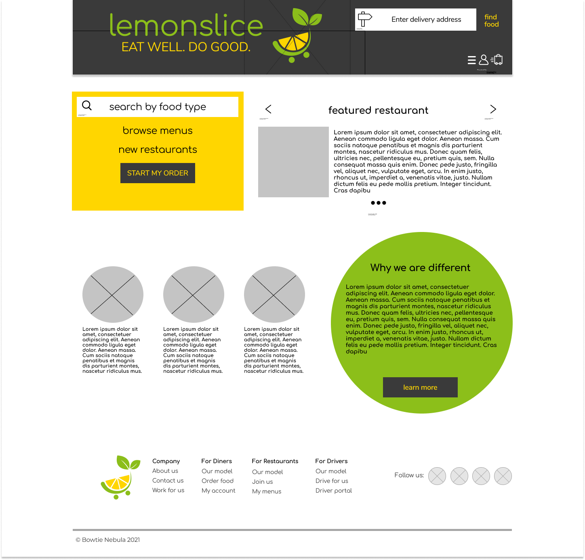

# Welcome to lemonslice!

### This demo project mocks up a food delivery service website.

**Main components of the MVP are:**
1. User account creation and editing, including password security features
2. Food and menu browsing by type and by specific restaurant
3. Submitting a mock order, including adding a tip. No actual payment information will be accepted.
4. A SQL database of users
5. Use of the Grubhub API for restaurant menus

**Future functionality will include:**
1. Restaurant partner portal
2. Driver partner portal

**The technologies underpinning this project are:**
1. Java
2. JavaScript
3. HTML/CSS
4. Angular
5. Tailwind CSS
6. Gradle

A wireframe / mockup of the front page:

